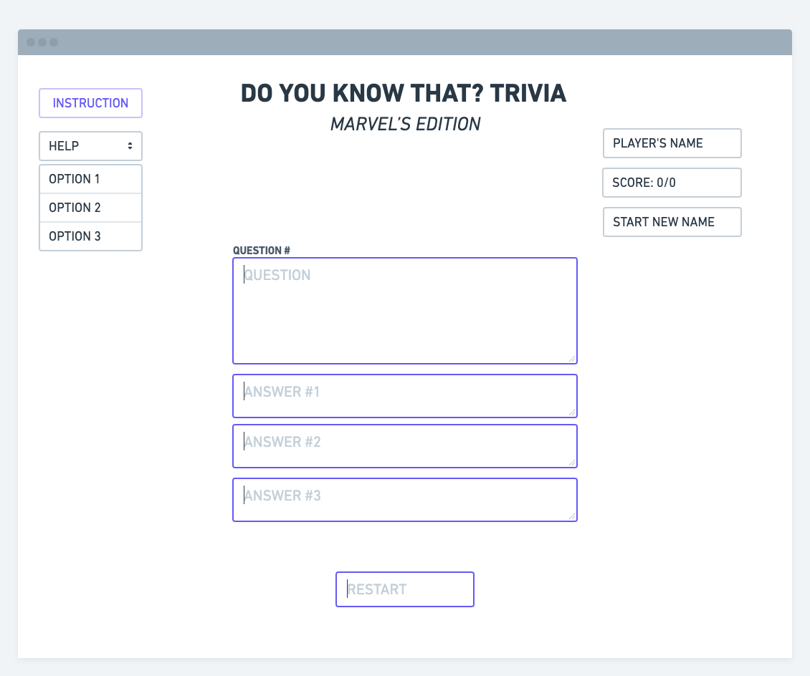
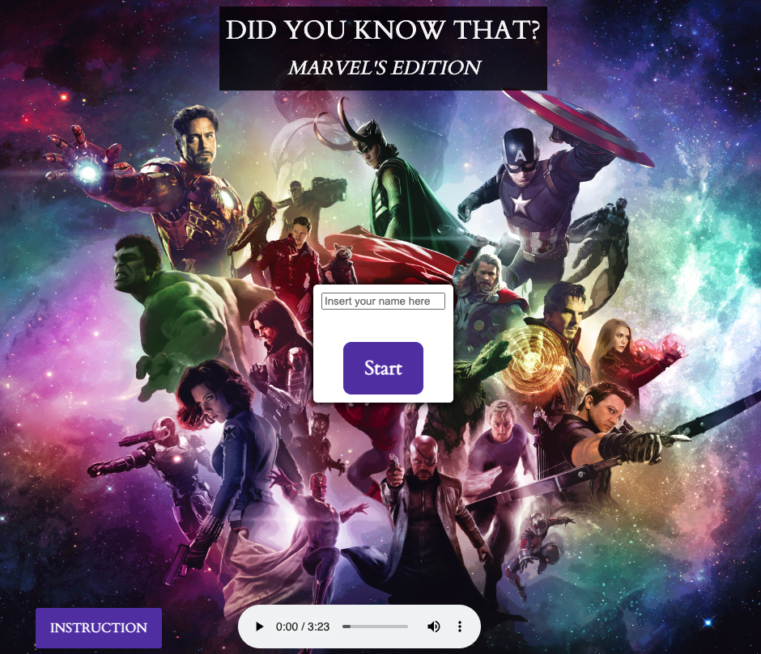
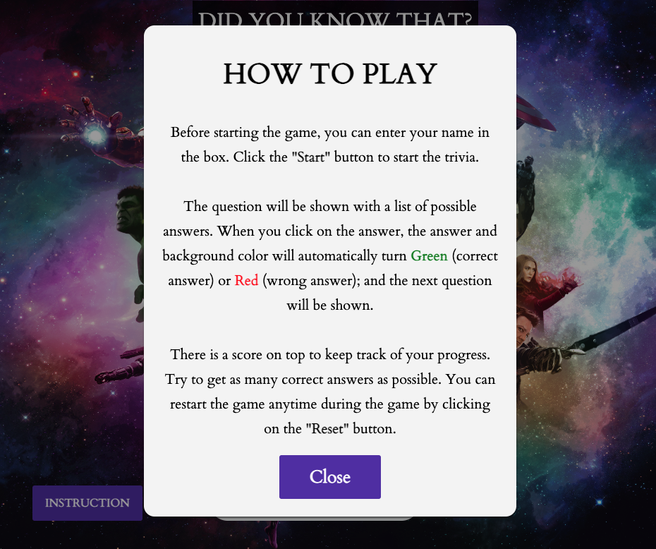
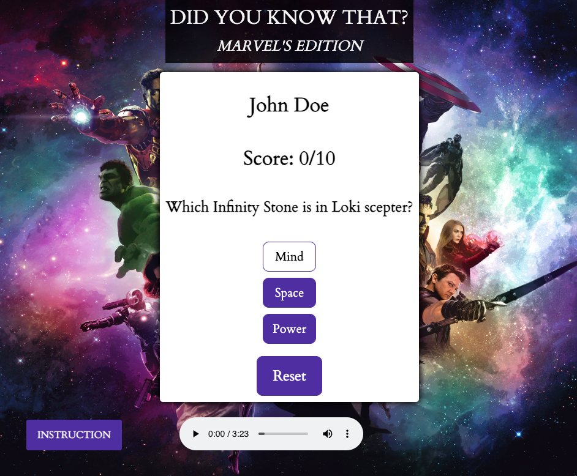

# Project 1: Trivia game - Did you know that?
## Trivia History
Trivia is defined as little-known facts or unimportant matters. Examples of trivia are details of a fight that happened decades ago. An example of trivia is a game in which team members race to see who can be the first to answer questions about insiginificant facts of history, popular culture, art and science.

Nowsaday, trivia night is more popular than ever and showing up on event calendars at bars, breweries, and restaurants - even local coffee shops and senior centers. It creates a sense of community and a lively atmosphere that invites more people to join in the fun.

## Wireframes
### Before:

### After:

### Instructions Modal:

### Main Content:

## Getting started:
To play the game, simply enter your name (if desired) in the input box and then click on 'Start' button. The question and available answers will automically show up. You will have to select at least one answer to advance to the next question. When you click on the question, the answer and background will change their background color to Green (the answer is correct) or Red (the answer is incorrect). You will keep answer the question until the game runs out of question. You will be able to reset the game at anytime you wish during the game by clicking on the 'Reset' button (This button will only be available during the game).
## Technologies:
+ HTML.
+ Cascading Style Sheet (CSS).
+ JavaScript.

## User Experience:
+ As a user, I want to be able to enter your name.
+ As a user, I want to be able to start the game.
+ As a user, I want to be able to restart anytime during the game.
+ As a user, I want to be notified whether your answer is correct or incorrect.
+ As a user, I want to be to read the instructions of the game.

## Stretch goals:
+ As a user, I want have the order of the questions change so it will not be the same every time.
+ As a user, I want to listen some music related to the trivia theme.
+ As a user, I want to know how well I am doing base on the score system.

## Possible future development:
+ Add difficulty level by allowing only a certain amount of wrong answers to pass the level.
+ Add different sets of question.
+ Add celebration at the end if you achieve beat the the level.
+ Create a leaderboard to keep high scores.

## Resources/Credits:
+ [TRIVIAL PURSUITS: From Where Does the Word Trivia Come?](https://www.plansponsor.com/trivial-pursuits-word-trivia-come/?layout=print)